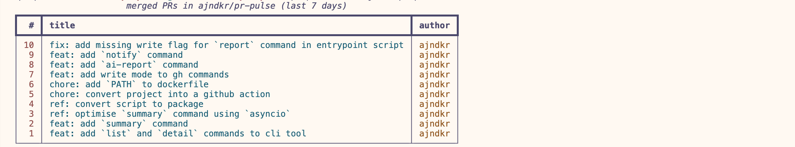
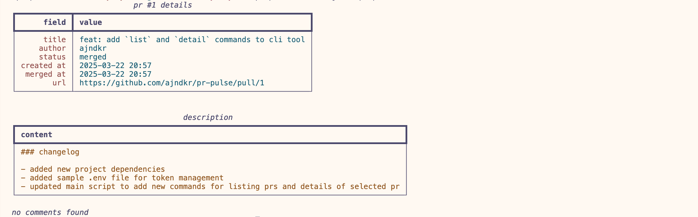
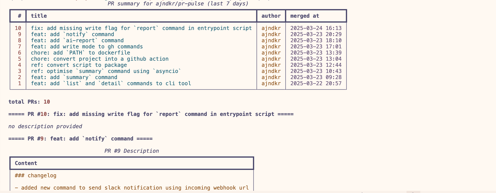
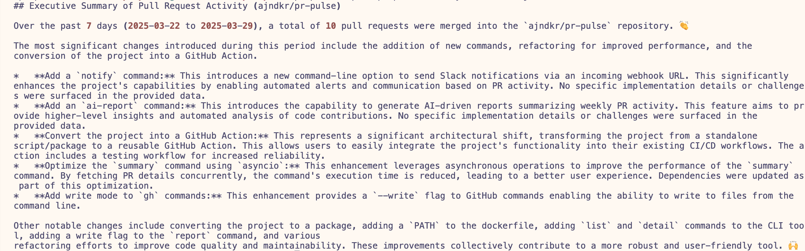

# pr-pulse

generate weekly reports of all code changes in a github repository.

<table>
  <tr>
    <td align="center">
      <br>
      <b>List Command</b>: Tabular view of merged PRs
    </td>
    <td align="center">
      <br>
      <b>Detail Command</b>: Complete information about a specific PR
    </td>
  </tr>
  <tr>
    <td align="center">
      <br>
      <b>Summary Command</b>: Overview of recent pull requests
    </td>
    <td align="center">
      <br>
      <b>Report Command</b>: AI-generated summary of PR activity
    </td>
  </tr>
</table>

## usage

#### basic example

```yaml
name: weekly-pr-report
on:
  schedule:
    - cron: "0 8 * * 1" # Runs at 8:00 AM UTC every Monday

jobs:
  generate-report:
    runs-on: ubuntu-latest
    steps:
      - name: generate pr report
        uses: ajndkr/pr-pulse@main
        with:
          github_token: ${{ secrets.GITHUB_TOKEN }}
          repository: "owner/repo"
          days: "7"
          command: "summary"
```

#### input parameters

| Parameter           | Description                                                      | Required | Default |
| ------------------- | ---------------------------------------------------------------- | -------- | ------- |
| `github_token`      | GitHub token for repository access                               | Yes      | -       |
| `repository`        | Target repository in format owner/repo                           | Yes      | -       |
| `days`              | Number of days to look back for PRs                              | No       | 7       |
| `output_format`     | Output format (table or json)                                    | No       | table   |
| `verbose`           | Show detailed progress logs                                      | No       | false   |
| `write`             | Write output to a file                                           | No       | false   |
| `command`           | Command to run (`list`, `detail`, `summary`, `report`, `notify`) | No       | summary |
| `pr_number`         | Pull request number for `detail` command                         | No       | -       |
| `api_key`           | GEMINI API key for `report` command                              | No       | -       |
| `slack_webhook_url` | Slack webhook URL for `notify` command                           | No       | -       |
| `input_file`        | Input file path for `report` and `notify` commands               | No       | -       |

**Note:** To create a Slack webhook URL, refer to
[Slack Incoming Webhooks](https://api.slack.com/messaging/webhooks).

## getting started (local development)

### pre-requisites

- [uv](https://docs.astral.sh/uv/#getting-started)

### init project

```shell
make init
```

to run pre-commit checks, run:

```shell
make ci
```

### run commands

run the following to view the list of available commands:

```shell
make run
```

## project roadmap

### phase 1

- [x] setup project
- [x] create commands to fetch data from github
- [x] convert project to github action to schedule cron jobs in target
      repository
- [x] add llm integration to generate weekly report
- [x] add slack integration to send weekly report

### phase 2

- [ ] improve customisability of commands
- [ ] add MCP support
- [ ] add support for more LLM providers
